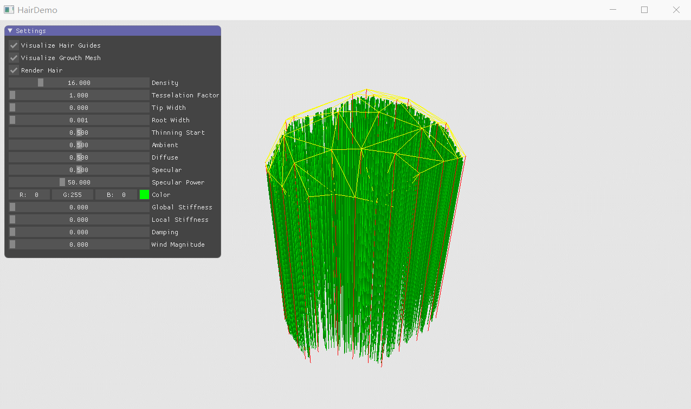
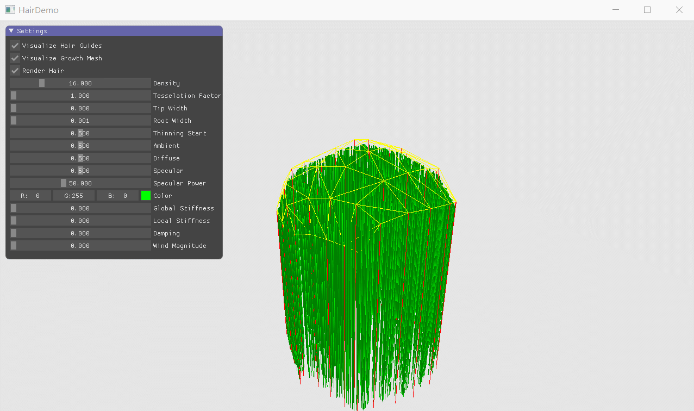
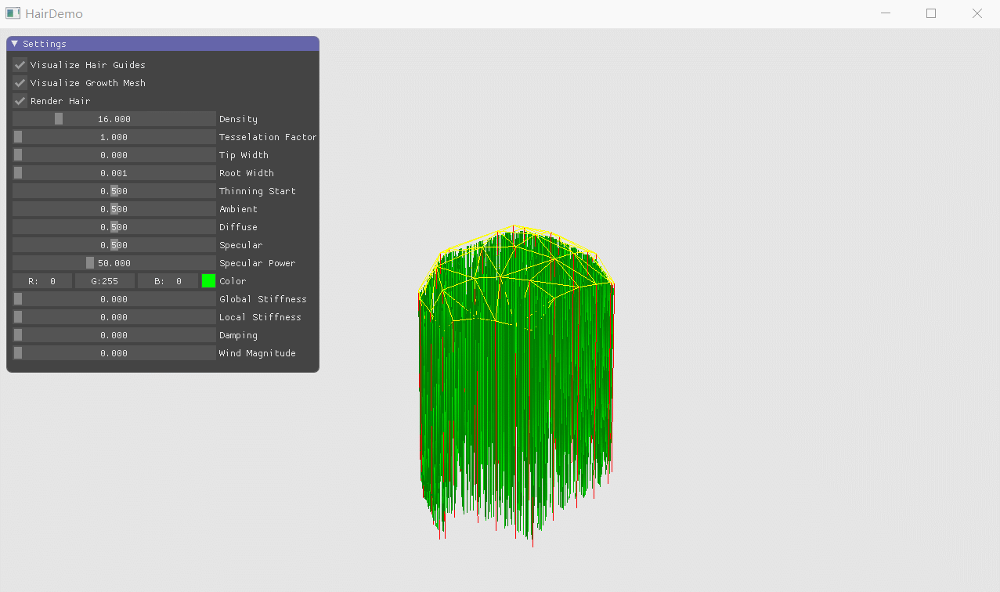
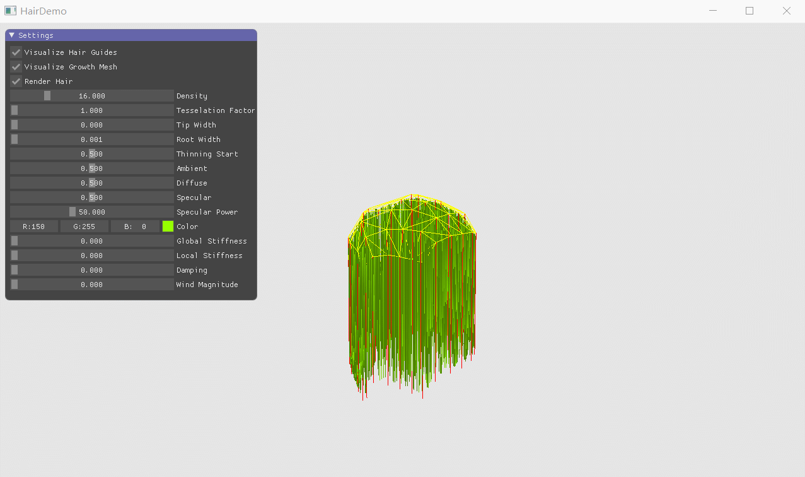

# HairSimulateAndRenderDemo
This is an implementation of realtime hair simulation and rendering.

Main Reference:
[SIGGRAPH 2010 Course Notes](http://developer.download.nvidia.com/presentations/2010/SIGGRAPH/HairCourse_SIGGRAPH2010.pdf)

### Density

### Width

### Thin

### Stiffness

### Color

### Wind

